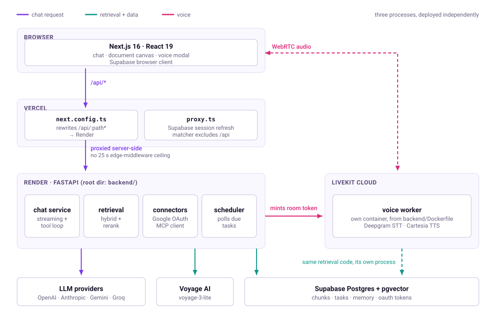
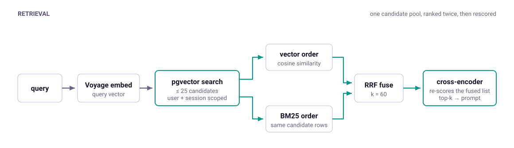

# Aether-Agentic-Workspace

An AI assistant with hybrid-retrieval RAG, live voice, a collaborative document canvas, and Google Workspace tool use, built on a provider-agnostic backend that swaps between OpenAI, Anthropic, Gemini and Groq without touching application code.

---

## What it does

Most chat wrappers pass your message straight to one model API. AetherChat sits on a retrieval and tool-use layer instead:

- **Grounded answers from your own documents.** Upload a PDF and ask about it. Retrieval runs a hybrid pipeline rather than plain vector search — dense embeddings and BM25 keyword ranking are fused, then reranked by a cross-encoder before anything reaches the model.
- **Real tool use.** Ten native tools (web search, calculator, weather, knowledge-base search, chat-history search, task CRUD) plus an MCP client layer that merges external MCP server schemas into the same tool list at runtime.
- **Google Workspace connectors.** OAuth into Gmail, Calendar and Drive; the assistant reads and acts on them through native tools.
- **Live voice.** A LiveKit agent with Deepgram STT and Cartesia TTS, running as its own worker process.
- **Document canvas.** A TipTap editor the assistant can write into, exportable to `.docx` or straight to Google Drive.
- **Tasks and reminders.** A background scheduler polls for due tasks independently of request handling.
- **Persistent memory.** A per-user narrative profile that survives across sessions.

## Architecture

<picture> <source media="(prefers-color-scheme: dark)" srcset="docs/architecture-dark.svg">  </picture>

Audio never touches the API. The API only mints a LiveKit room token; the browser and the voice worker then meet in that room over WebRTC. The worker runs the same retrieval code as the API, in its own process, against the same database.

Backend calls are proxied by `next.config.ts` rewrites, while `proxy.ts` handles Supabase session refresh with `/api` excluded from its matcher — so a backend call never pays for a session round trip, and never hits Edge Middleware's 25-second ceiling.

Three processes deploy independently from this one repository:

| Process | Platform | Source |
| --- | --- | --- |
| Web client | Vercel | repository root |
| API | Render | `backend/` (set as the service's Root Directory) |
| Voice worker | LiveKit Cloud | built from `backend/Dockerfile` |

### Retrieval pipeline

The part worth reading the code for — `backend/api/documents/services.py`:

1. **Embed** the query with Voyage `voyage-3-lite`.
2. **Vector search** over `document_chunks` in pgvector, scoped to the requesting user.
3. **BM25** keyword ranking over the same candidate pool via `rank_bm25`.
4. **Reciprocal rank fusion** merges the two rankings — this recovers exact-term matches that dense retrieval alone loses (product names, error codes, proper nouns).
5. **Cross-encoder rerank** with `fastembed`, capped at 25 candidates so the stage stays cheap, pinned to one thread so the ONNX session cannot saturate the host. Measured below — on the current eval set this stage does not improve results.
6. Top-k chunks go into the prompt.

<picture> <source media="(prefers-color-scheme: dark)" srcset="docs/retrieval-dark.svg">  </picture>

BM25 re-ranks the rows pgvector already returned — it is not a second, independent search over the corpus. Both rankings cover the same candidate pool, which is what makes reciprocal rank fusion meaningful here.

### Provider abstraction

`backend/providers/base.py` defines one interface, implemented by `openai.py`, `anthropic.py`, `gemini.py`, `groq.py` and `mock.py`. `factory.py` selects at runtime. Adding a provider means adding one file — no call site changes. `mock.py` is what lets the test suite run without any API key.

## Evaluating retrieval

| Configuration | Hit Rate@3 | Hit Rate@5 | MRR@5 |
| --- | --- | --- | --- |
| Vector only | 0.571 | 0.643 | 0.528 |
| Vector + BM25 (RRF) | **0.750** | **0.821** | **0.663** |
| Vector + BM25 + cross-encoder rerank | 0.679 | 0.679 | 0.548 |

28 queries, `top_k = 5`. All three configurations rank the same candidate pool,
so the differences are attributable to ranking alone.

**Fusing BM25 with vector search is a clear win** — five more queries hit at both
k=3 and k=5. Exact-term matches that dense retrieval alone loses (names, dates,
document versions) are what RRF recovers.

**The cross-encoder rerank does not help on this set.** It costs two hits at k=3,
four at k=5, and lowers MRR. One caveat on the metric: a hit requires the exact
labelled chunk to be returned, so a reranker that surfaces a different but equally
useful chunk from the correct document scores as a miss. At 28 queries this is
suggestive rather than conclusive, so the stage stays in the pipeline pending a
per-query breakdown.

## Tech stack

| Layer | Choice |
| --- | --- |
| Frontend | Next.js 16.2.9, React 19.2.4, TypeScript, Tailwind v4 |
| Editor | TipTap 3, `docx` for export |
| Backend | FastAPI, Python 3.11, `uvicorn` |
| LLM providers | OpenAI, Anthropic, Gemini, Groq (factory pattern) |
| Embeddings | Voyage AI `voyage-3-lite` |
| Retrieval | pgvector, `rank_bm25`, `fastembed` cross-encoder |
| Auth + DB | Supabase (SSR auth, Postgres, pgvector) |
| Voice | LiveKit, Deepgram STT, Cartesia TTS |
| Tools | MCP 1.29, Google Workspace APIs |
| Hosting | Vercel, Render, LiveKit Cloud |

## Running locally

Requires Node 20+, Python 3.11+, and a Supabase project.

```bash
git clone https://github.com/hiqra694-alt/Aether-Agentic-Workspace.git
cd Aether-Agentic-Workspace
```

**1. Database.** Run `supabase_schema.sql` against your Supabase project, then the migrations in `reference/` in numeric order — `001_pgvector_document_chunks.sql` through `007_user_oauth_tokens.sql`. `001` enables the pgvector extension, so it must run first.

**2. Backend.**

```bash
cd backend
python -m venv .venv && source .venv/bin/activate   # Windows: .venv\Scripts\activate
pip install -r requirements.txt
cp .env.example .env        # fill in your keys — every variable is documented inline
uvicorn main:app --reload --port 8000
```

Only four variables are needed to boot:

```
SUPABASE_URL=
SUPABASE_ANON_KEY=
VOYAGE_API_KEY=
GROQ_API_KEY=            # or OPENAI / ANTHROPIC / GEMINI
```

Everything else is optional. Google connectors, Drive export, the voice agent and the scheduler each disable themselves cleanly when their keys are unset, rather than failing at startup.

**3. Frontend.** From the repository root, in a second terminal:

```bash
npm install
cp .env.local.example .env.local
# NEXT_PUBLIC_SUPABASE_URL, NEXT_PUBLIC_SUPABASE_ANON_KEY, NEXT_PUBLIC_BACKEND_URL, NEXT_PUBLIC_LIVEKIT_URL
npm run dev
```

Open http://localhost:3000.

**4. Voice worker (optional).** Third terminal:

```bash
cd backend
pip install -r requirements-worker.txt
python -m voice.agent dev
```

Needs `LIVEKIT_URL`, `LIVEKIT_API_KEY`, `LIVEKIT_API_SECRET`, `DEEPGRAM_API_KEY`, `CARTESIA_API_KEY` in `backend/.env`, and `NEXT_PUBLIC_LIVEKIT_URL` in `.env.local` — the browser connects to the LiveKit room directly, so the frontend needs the URL too. Without it the app runs normally and only voice mode reports it as missing.


## API reference

Routes are prefixed `/api` except the root health check. Interactive docs at `/docs` when the backend is running.

| Method | Path | Purpose |
|---|---|---|
| `GET` | `/` | Health check |
| `GET` | `/api/health` | Health check |
| `POST` | `/chat` | Streaming chat with the tool-use loop |
| `POST` | `/documents/upload` | Ingest a PDF: parse, chunk, embed, store |
| `GET` | `/documents` | List the user's documents |
| `DELETE` | `/documents/{document_name}` | Delete a document and its chunks |
| `GET` | `/memory` | Read the user's memory profile |
| `DELETE` | `/memory` | Clear it |
| `GET` | `/tasks` | List tasks (`?status=`, `?due_only=`) |
| `PATCH` | `/tasks/{task_id}/complete` | Mark complete |
| `DELETE` | `/tasks/{task_id}` | Delete |
| `GET` | `/connectors/status` | Which providers are connected |
| `POST` | `/connectors/store-token` | Persist an OAuth token |
| `DELETE` | `/connectors/disconnect` | Revoke a provider |
| `GET` | `/connectors/google/authorize` | Start Workspace OAuth |
| `GET` | `/connectors/google/callback` | OAuth callback |
| `GET` | `/canvas/drive/authorize` | Start Drive OAuth (`drive.file` scope) |
| `GET` | `/canvas/drive/callback` | OAuth callback |
| `POST` | `/canvas/export` | Export canvas to Drive |
| `POST` | `/voice/token` | Issue a LiveKit room token |

### Native tools

`duckduckgo_search` · `calculator` · `get_current_time` · `get_weather` · `search_chat_history` · `search_knowledge_base` · `list_documents` · `create_task` · `list_tasks` · `complete_task`

Plus Google Workspace tools in `backend/connector_integrations/google_tools.py`, gated on connection status, and anything exposed by a configured MCP server.

## Tests

```bash
cd backend && pytest
```

159 tests across the chat service, tool dispatch, retrieval, connectors, the intent router, the scheduler and every API router. The suite runs without any provider key — `providers/mock.py` stands in for live LLM calls.

## Notes on the deployment

**Cold starts.** The API runs on Render's free tier, which sleeps the service after roughly 15 minutes of inactivity; waking takes about 50 seconds. Backend calls are proxied through `next.config.ts` rewrites rather than Vercel Edge Middleware, whose 25-second ceiling is shorter than a cold start.

**Process separation.** The voice agent never runs in the API process. The API carries only `livekit-api`, which it uses to mint room tokens at `POST /api/voice/token`. The agent itself deploys to LiveKit Cloud from `backend/Dockerfile` and installs `requirements-worker.txt`, which layers `livekit-agents` and its Deepgram and Cartesia plugins on top of `requirements.txt`, so the STT/TTS stack never ships with the API.

**Graceful shutdown.** The task scheduler runs as an `asyncio.Task` started in the lifespan handler and stopped via an `asyncio.Event` rather than `task.cancel()`, so a poll mid-flight at shutdown finishes its database call instead of being severed.

## Project layout

```
src/app/page.tsx              chat UI, tasks, memory, connector panel
src/components/               VoiceModal, CanvasWorkspace, AetherLogo
src/lib/tiptap-to-docx.ts     canvas → .docx conversion
src/utils/supabase/           SSR client, server client, session middleware
reference/                    SQL migrations + RAG pipeline reference
scripts/                      retrieval eval harness + miss diagnosis
backend/
  main.py                     app factory, lifespan, router registration
  api/chat/                   streaming chat, tool loop, tool definitions
  api/documents/              ingestion + the hybrid retrieval pipeline
  api/memory/                 per-user narrative profile
  api/tasks/                  task CRUD
  api/connectors/             connector status + Google Workspace OAuth
  connector_integrations/     MCP manager, Google tools, intent router
  canvas/                     Drive OAuth + document export
  voice/                      LiveKit token route + the agent worker
  core/                       settings, background scheduler
  tests/                      159 pytest tests
```

## License

MIT — see [LICENSE](LICENSE).
